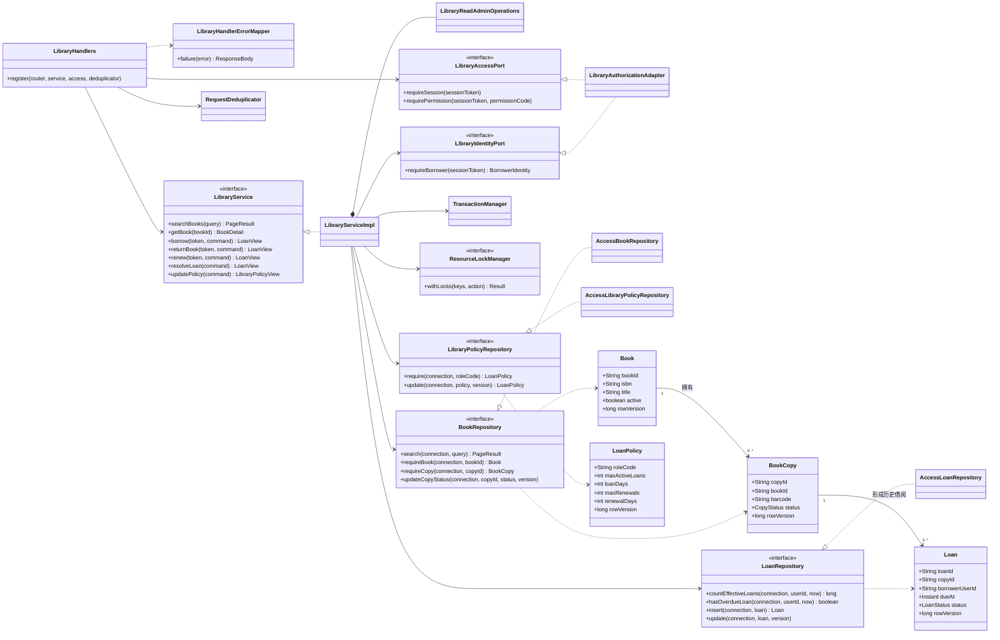
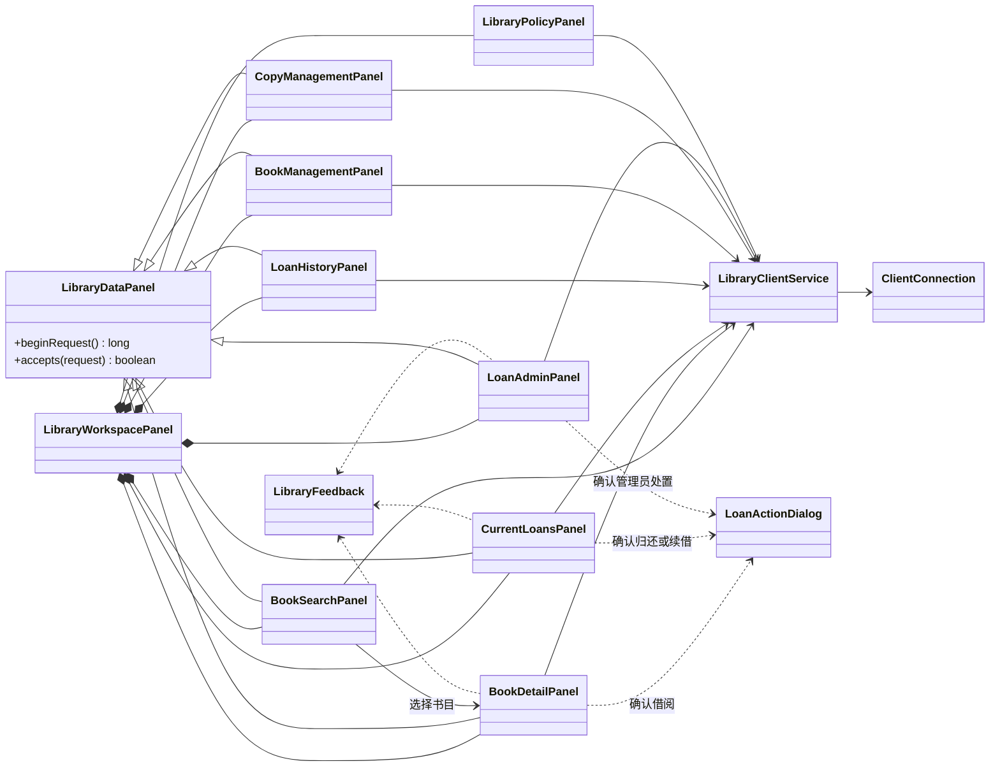
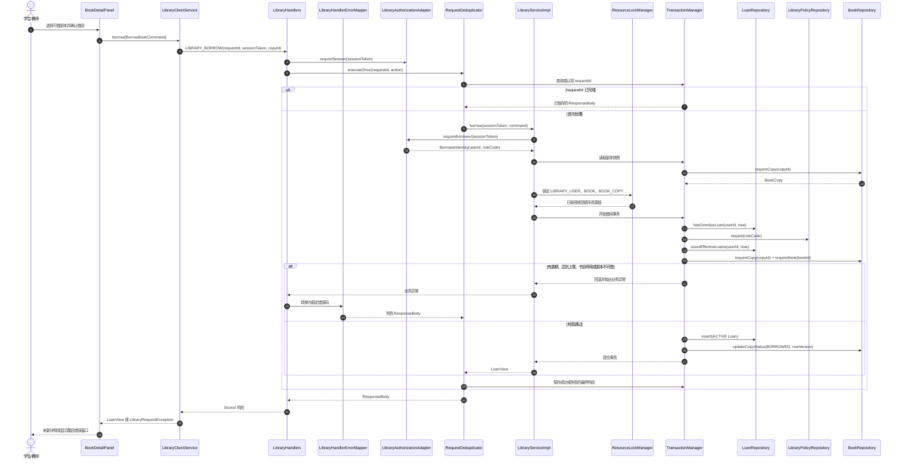
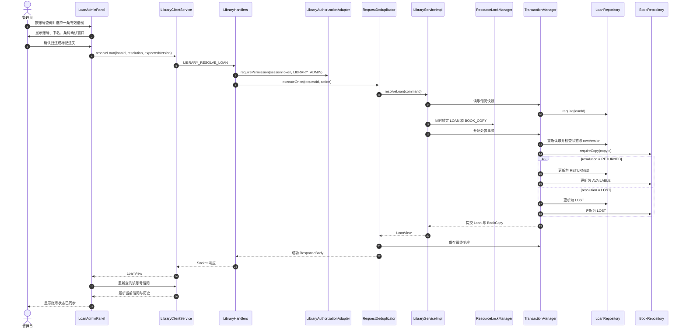

# vCampus 图书管理模块

图书管理模块建立在 vCampus 用户模块的会话、用户身份和权限体系之上，提供书目检索、实体副本管理、借阅、归还、续借、逾期处理、管理员借阅处置和借阅策略配置。

本模块不处理罚款或支付。逾期的直接影响是禁止新增借阅和续借，并在用户及管理员界面中明确显示。

## 1. 功能与角色

| 功能 | 学生 | 教师 | 图书管理员 |
|---|:---:|:---:|:---:|
| 检索启用书目、查看馆藏副本 | ✓ | ✓ | ✓ |
| 借阅、归还、续借 | ✓ | ✓ |  |
| 查看本人当前借阅和历史 | ✓ | ✓ | ✓ |
| 查看停用书目 |  |  | ✓ |
| 新建、编辑、启用或停用书目 |  |  | ✓ |
| 新增副本、维护副本状态 |  |  | ✓ |
| 按账号查询并处理借阅 |  |  | ✓ |
| 配置学生和教师借阅策略 |  |  | ✓ |

管理员功能由用户模块权限 `LIBRARY_ADMIN` 控制。学生和教师借阅时分别使用 `STUDENT`、`TEACHER` 策略；管理员账号用于馆藏管理，不配置个人借阅策略。普通功能要求有效会话；服务端不会信任客户端传入的用户身份，而是根据 `sessionToken` 解析当前用户。

## 2. 模块结构

```text
vcampus-common/src/main/java/edu/seu/vcampus/common/library
  命令、查询、枚举和返回视图，供客户端与服务端共享

vcampus-client/src/main/java/edu/seu/vcampus/client/library
  service/  异步 Socket 客户端门面
  ui/       Swing 图书馆工作区和各业务页面

vcampus-server/src/main/java/edu/seu/vcampus/server/library
  domain/      Book、BookCopy、Loan、LoanPolicy
  handler/     消息路由、权限检查和错误映射
  service/     业务规则、事务与并发控制
  repository/  Repository 接口和 Access 实现

vcampus-database
  schema/040_library.sql        图书馆表和索引
  seed/040_library_policy.sql   默认借阅策略
```

一次请求的主要调用方向为：

```text
Swing 页面
  -> LibraryClientService
  -> ClientConnection / Socket
  -> LibraryHandlers
  -> LibraryServiceImpl
  -> Repository
  -> vCampus.accdb
```

## 3. UML 类图

### 3.1 核心服务与持久化



### 3.2 客户端 UI 组合



`LibraryWorkspacePanel` 只在当前用户拥有 `LIBRARY_ADMIN` 时创建管理页面。切换栏目时会调用对应页面的刷新动作，首次打开工作区也会自动加载当前栏目。

## 4. UML 顺序图

### 4.1 借阅一本实体副本



借阅记录和副本状态在同一事务内修改，因此不会出现“副本已借出但没有借阅记录”或相反状态。同一副本的并发借阅只允许一个请求成功。

### 4.2 管理员处理某个账号的借阅



管理员不能直接把存在有效借阅的副本改成“可借”。归还和报失必须从借阅管理发起，从而保证借阅人页面、借阅历史与副本状态使用同一份服务端事实。

## 5. 领域模型与状态规则

### 5.1 书目与副本

- `isbn` 唯一标识一个书目，重复时返回 `LIBRARY_DUPLICATE_ISBN`。
- `barcode` 唯一标识一个实体副本，重复时返回 `LIBRARY_DUPLICATE_BARCODE`。
- 停用书目不会出现在普通检索中，但管理员仍可查询和重新启用。
- 停用书目禁止新增副本、借阅和续借；已有借阅仍可归还或由管理员处理。

副本状态：

```text
AVAILABLE --借阅--> BORROWED
BORROWED  --归还--> AVAILABLE
BORROWED  --管理员报失--> LOST
LOST      --找回--> AVAILABLE / DAMAGED
AVAILABLE <--------> DAMAGED   （无有效借阅时由管理员维护）
```

`BORROWED` 和 `LOST` 不能通过普通副本状态编辑直接写入，必须由借阅业务产生。

### 5.2 借阅

有效借阅包括 `ACTIVE` 和 `OVERDUE`：

```text
ACTIVE --超过 dueAt--> OVERDUE
ACTIVE / OVERDUE --归还--> RETURNED
ACTIVE / OVERDUE --管理员报失--> LOST
ACTIVE --续借--> ACTIVE（dueAt 延后，renewCount + 1）
```

主要规则：

- 一个副本同时最多存在一条有效借阅。
- 用户存在逾期借阅时不能新增借阅。
- 当前有效借阅数不能超过角色策略。
- 只有本人可以归还或续借自己的记录。
- 逾期记录、已归还记录和已报失记录不能续借。
- 借阅历史永久保留，不物理删除。
- 查询时会把 `dueAt < now` 的 `ACTIVE` 记录动态显示为 `OVERDUE`，因此不依赖维护任务及时运行。

### 5.3 默认策略

策略保存在 `tblLibraryPolicy`，不是硬编码在业务服务中。

| 角色 | 最大在借 | 默认借期 | 最大续借 | 每次续借 |
|---|---:|---:|---:|---:|
| `STUDENT` | 5 本 | 30 天 | 1 次 | 15 天 |
| `TEACHER` | 10 本 | 60 天 | 2 次 | 30 天 |

策略更新使用 `rowVersion` 防止多个管理员互相覆盖。新策略影响后续借阅和续借，不追溯修改已产生借阅的原到期时间。

## 6. 消息接口

| 命令 | 请求体 | 权限 | 说明 |
|---|---|---|---|
| `LIBRARY_SEARCH_BOOKS` | `BookSearchQuery` | 已登录 | 查询启用书目 |
| `LIBRARY_GET_BOOK` | `String bookId` | 已登录 | 获取书目和副本详情 |
| `LIBRARY_BORROW` | `BorrowBookCommand` | 已登录 | 借阅副本 |
| `LIBRARY_RETURN` | `ReturnBookCommand` | 已登录 | 本人归还 |
| `LIBRARY_RENEW` | `RenewLoanCommand` | 已登录 | 本人续借 |
| `LIBRARY_GET_MY_CURRENT_LOANS` | `EmptyRequest` | 已登录 | 查询本人有效借阅 |
| `LIBRARY_GET_MY_LOAN_HISTORY` | `LoanHistoryQuery` | 已登录 | 查询本人历史 |
| `LIBRARY_SEARCH_MANAGED_BOOKS` | `BookSearchQuery` | `LIBRARY_ADMIN` | 查询全部书目，包括停用项 |
| `LIBRARY_CREATE_BOOK` | `CreateBookCommand` | `LIBRARY_ADMIN` | 新建书目 |
| `LIBRARY_UPDATE_BOOK` | `UpdateBookCommand` | `LIBRARY_ADMIN` | 编辑或启停书目 |
| `LIBRARY_ADD_COPY` | `AddBookCopyCommand` | `LIBRARY_ADMIN` | 新增实体副本 |
| `LIBRARY_CHANGE_COPY_STATUS` | `ChangeCopyStatusCommand` | `LIBRARY_ADMIN` | 维护无有效借阅的副本 |
| `LIBRARY_SEARCH_ALL_LOANS` | `AdminLoanSearchQuery` | `LIBRARY_ADMIN` | 按账号、状态等查询借阅 |
| `LIBRARY_RESOLVE_LOAN` | `AdminResolveLoanCommand` | `LIBRARY_ADMIN` | 管理员归还或报失 |
| `LIBRARY_GET_POLICIES` | `EmptyRequest` | `LIBRARY_ADMIN` | 读取学生和教师策略 |
| `LIBRARY_UPDATE_POLICY` | `UpdateLibraryPolicyCommand` | `LIBRARY_ADMIN` | 更新一个角色策略 |

所有写请求都使用 `requestId` 去重。服务端会保存成功或失败的最终 `ResponseBody`；客户端因网络问题重发同一个请求时，不会重复借阅或重复修改状态。

## 7. 数据库

| 表 | 用途 | 关键唯一约束 |
|---|---|---|
| `tblBook` | 书目元数据和启停状态 | `isbn` |
| `tblBookCopy` | 带条码和馆藏位置的实体副本 | `barcode` |
| `tblBookLoan` | 当前借阅及永久历史 | `loanId` 主键 |
| `tblLibraryPolicy` | 学生、教师的借阅限制 | `roleCode` |
| `tblRequestDedup` | 写请求去重结果 | `requestId` |

逻辑关系为 `tblBook.bookId -> tblBookCopy.bookId -> tblBookLoan.copyId`，借阅人通过 `tblBookLoan.borrowerUserId -> tblUser.userId` 关联用户模块。账号名称变化不会破坏借阅关系；借阅查询会联接用户表显示当前账号名称。

## 8. 一致性与冲突处理

- 借阅锁定 `LIBRARY_USER`、`BOOK` 和 `BOOK_COPY`。
- 归还及管理员处置同时锁定 `LOAN` 和 `BOOK_COPY`。
- 续借锁定 `LIBRARY_USER`、`LOAN` 和 `BOOK`。
- 资源锁按固定条带编号顺序取得，避免不同业务路径形成循环等待。
- `Book`、`BookCopy`、`Loan`、`LoanPolicy` 使用 `rowVersion` 乐观锁；过期页面会收到具体的 stale 错误码。
- 借阅记录和副本状态在同一个数据库事务中提交或回滚。
- `TransactionManager` 串行执行 Access 数据库事务，规避 UCanAccess 单文件数据库在并发打开、关闭连接时的驱动锁死问题。网络请求仍可并发执行，但数据库写入按事务排队。

界面通过 `LibraryFeedback` 将冲突、重复数据、会话过期和权限不足显示为醒目模态窗口。收到版本冲突后应刷新相应页面，再根据最新数据决定是否重试。

## 9. UI 页面

普通用户可以看到：

- **馆藏检索**：按关键字、分类和可借状态搜索，选择书目后显示详情和副本。
- **当前借阅**：显示书目、条码、位置、借阅时间、应还时间、续借次数和状态。
- **借阅历史**：分页查询本人全部历史。

管理员额外可以看到：

- **书目管理**：搜索、新增、编辑、启用或停用书目。
- **副本管理**：默认显示所有副本，并可按关键字搜索和维护状态。
- **借阅管理**：按账号单独查询，查看完整当前借阅和历史，并逐条归还或报失。
- **设置**：两行分别配置学生和教师策略，下方显示只读服务端、数据库状态。

切换到任一栏目时会自动刷新，不要求用户再手动点击一次刷新按钮。异步页面使用请求代次保护，较早返回的请求不会覆盖较新的页面状态。

## 10. 构建、运行与测试

要求 JDK 21 和 Maven。在仓库根目录构建：

```powershell
mvn -pl vcampus-server,vcampus-client -am package
```

打包完成后会更新：

```text
vcampus-distribution/lib/vCampusServer.jar
vcampus-distribution/lib/vCampusClient.jar
```

Windows 演示环境可依次运行：

```powershell
vcampus-distribution\scripts\start-server.bat
vcampus-distribution\scripts\start-client.bat
```

默认连接参数：

```text
服务端地址：127.0.0.1
服务端端口：8888
数据库：vcampus-distribution/data/vCampus.accdb
```

执行全部相关模块测试：

```powershell
mvn -pl vcampus-server,vcampus-client -am test
```

当前回归基线为 191 项测试：common 1、server 152、client 38。

## 11. 本地测试账号

| 身份 | 账号 | 密码 |
|---|---|---|
| 学生 | `as812` | `1234` |
| 教师 | `as811` | `1234` |
| 管理员 | `ADMIN` | `1234` |

这些账号和密码仅用于本地课程演示，不应用于真实环境。

## 12. 当前边界

- 不包含罚款、支付、预约和馆际互借。
- `OverdueMaintenanceJob` 可以批量把到期记录持久化为 `OVERDUE`，但当前 `ServerMain` 未注册周期调度器；借阅限制和界面展示依靠动态到期判断，功能不受调度延迟影响。
- Access 数据库适合本地课程演示。若未来需要更高并发量，应迁移到支持服务端并发事务的数据库，再评估是否取消事务串行化。

原始设计与实施计划分别位于：

- [`docs/superpowers/specs/2026-08-24-vcampus-library-module-design.md`](../superpowers/specs/2026-08-24-vcampus-library-module-design.md)
- [`docs/superpowers/plans/2026-08-24-vcampus-library-module.md`](../superpowers/plans/2026-08-24-vcampus-library-module.md)
