# vCampus 商店模块功能图

本文档描述 vCampus 多商户商城的主要业务流程、角色权限、跨店订单结构和核心状态变化。Shop 模块依赖 Foundation 提供的鉴权、消息通信、事务和资源锁能力，但不负责实现这些公共基础设施。

## 1. 买家购物主流程

客户端负责展示页面和发起操作，商品状态、实时价格、可售库存及操作权限均由服务端重新校验。结算时不会立即扣减库存，而是先预留 15 分钟；只有支付成功后才正式扣减实际库存。

## 2. 商城角色与功能

- 学生和教师天然拥有买家能力。
- 店主不是新的基础角色，而是管理员审批后附加的业务能力。
- 店主只能操作自己的店铺、商品和订单。
- Shop 模块只调用 Foundation 提供的公共接口，不实现 Foundation 本身。

## 3. 跨店订单拆分

跨店订单采用三级结构：

- `OrderGroup`：代表买家的一次统一结算。
- `Order`：按照店铺拆分的子订单，每个店主只能处理自己的子订单。
- `OrderItem`：保存下单时的商品名称、SKU、价格和店铺名称快照。

整个订单组只对应一个聚合支付单。支付失败不会重新创建订单或重复预留库存，只会追加一条支付尝试记录，并允许用户在库存预留期内重试。

## 4. 商城核心状态流转

关键状态规则：

- 待审核申请不可编辑；被驳回后，申请人修改时回到草稿状态。
- 店铺停用不会撤销已经批准的店主申请。
- 支付失败不会让聚合支付单进入失败终态，而是继续保持 `PENDING`，允许重试。
- 只有支付成功才扣减实际库存；取消或过期只释放预留库存。
- 订单组内全部店铺子订单完成后，订单组才变为 `COMPLETED`。

## 5. 模块边界

Shop 负责人拥有商城相关的 Swing 页面、DTO、Handler、Service、Repository、数据库表、测试和文档。鉴权、Socket 通信、通用事务、资源锁和用户身份查询由公共模块提供，Shop 仅通过公开接口进行调用。

## 6. 设计依据

- `docs/superpowers/specs/2026-08-24-vcampus-shop-module-design.md`
- `docs/superpowers/plans/2026-08-24-vcampus-shop-module.md`
- `docs/superpowers/specs/2026-08-24-vcampus-overall-architecture-design.md`
- `docs/superpowers/plans/2026-08-24-vcampus-foundation.md`
