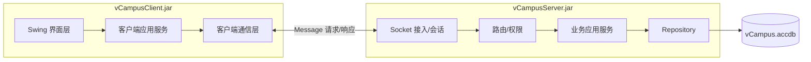
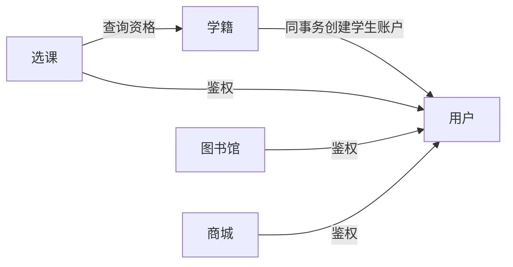

# 虚拟校园系统总体架构设计

## 1. 文档目的

本文定义虚拟校园课程设计的系统边界、运行架构、公共协议、并发模型、数据库规范、工程结构和验收基线。五份业务模块设计必须遵循本文，不得自行修改公共命令格式、会话语义、错误响应或跨模块依赖方向。

设计依据为仓库中的《软件实践安排(202509).docx》和《软件设计说明书DEMO(20250825).docx》，并结合团队在设计评审中确认的 JDK、数据库、界面、模块边界和业务规则。

## 2. 已确认范围

- 团队共五人，每人端到端负责一个必做模块：用户管理、学籍管理、选课系统、图书馆、商城。
- 不实现银行、医院、宿舍、在线课堂等选做模块。
- 选课系统不保存或展示具体成绩，但保存 `PASSED`/`FAILED` 修读结果以判断重修资格。
- 商城为校园多商户商城，包含首页推荐、搜索、店铺、购物车、订单和模拟第三方支付。
- 学生登录标识为一卡通号；管理员录取建档时同时生成一卡通号、学号、用户账户和学生档案。
- 最终交付两个可运行文件：`vCampusClient.jar` 和 `vCampusServer.jar`，数据库名为 `vCampus.accdb`。

## 3. 技术决策

| 项目 | 决策 |
|---|---|
| Java | JDK 21，不使用预览特性 |
| 构建 | Maven 聚合多模块工程 |
| 客户端 | Java Swing |
| 架构 | 模块化单体 C/S |
| 网络 | TCP 长连接、Java 对象流、可序列化 `Message` |
| 服务端并发 | 连接读取循环 + 固定业务线程池 + 资源条带锁 |
| 数据库 | Access `vCampus.accdb`，UCanAccess JDBC |
| 测试 | JUnit 5、Mockito、AssertJ、Access 集成测试、并发测试 |
| 日志 | SLF4J + Logback |

课程材料要求兼容 JDK 1.8；本项目根据团队确认改用 JDK 21。启动脚本必须检测 Java 版本不低于 21，部署环境必须预装对应运行时。

## 4. 运行架构



客户端不得直接访问 Access。服务端业务模块按 `handler → service → repository` 分层；跨模块调用只能使用公开 Port，禁止读取其他模块 Repository。

## 5. Maven 工程

```text
vcampus/
├── pom.xml
├── vcampus-common/
├── vcampus-client/
├── vcampus-server/
├── vcampus-database/
├── vcampus-docs/
└── vcampus-distribution/
```

- `vcampus-common`：协议、DTO、共享值对象、错误码和通用校验；不依赖 Swing、JDBC 或服务端实现。
- `vcampus-client`：Swing 页面、会话、导航、连接和五个客户端模块。
- `vcampus-server`：启动、网络、会话、权限、路由、事务、并发和五个服务端模块。
- `vcampus-database`：Access 模板库、结构说明和演示数据。
- `vcampus-distribution`：两个 JAR、配置、数据库、脚本、文档和 JavaDoc。

基础包名为 `edu.seu.vcampus`。每个 Java 文件原则上不超过 200 行；接口、类和公开方法必须提供 JavaDoc。

## 6. 公共消息协议

```java
public final class Message implements Serializable {
    private static final long serialVersionUID = 1L;
    private String requestId;
    private MessageType type;
    private String command;
    private String sessionToken;
    private Serializable body;
    private long timestamp;
}

public enum MessageType { REQUEST, RESPONSE, EVENT }

public final class ResponseBody<T extends Serializable>
        implements Serializable {
    private boolean success;
    private String code;
    private String message;
    private T data;
    private ErrorDetail error;
}
```

连接双方只创建一次 `ObjectOutputStream` 和 `ObjectInputStream`，先创建输出流并 `flush()`。每个命令绑定唯一请求 DTO、响应 DTO、权限和处理器。禁止使用无类型的 `Map<String,Object>` 作为业务载荷，禁止传输数据库实体或 Swing 组件。

客户端通过 `requestId` 关联 `CompletableFuture`。查询默认超时 10 秒，普通写入 15 秒，商城结算 30 秒。查询可在保持同一 `requestId` 时重试一次；写请求不得以新 `requestId` 自动重试。

## 7. 会话与权限

- 登录前只允许 `USER_REGISTER`、`USER_LOGIN` 和连接探测；`USER_REGISTER` 仅用于教师账户申请，请求不接受可选角色。
- 登录成功后由服务端生成不可预测的会话令牌；客户端仅保存在内存中。
- 学生使用一卡通号作为 `loginId`。新生账户初始密码固定为 `12345678`，账户创建时必须设置 `mustChangePassword=TRUE`。
- 使用初始密码登录只获得受限会话，仅允许 `USER_GET_CURRENT`、`USER_CHANGE_PASSWORD` 和 `USER_LOGOUT`；修改密码成功后撤销该会话并要求重新登录。
- 登录前空闲 5 分钟断开，登录后空闲 30 分钟过期。
- 账户禁用、注销或密码安全重置时立即撤销该用户所有会话。
- 基础角色为 `STUDENT`、`TEACHER`、`ADMIN`；店主是审批产生的业务能力，不改变教师或学生基础角色。
- 客户端菜单隐藏不是安全边界，所有命令都必须在服务端重新鉴权。

## 8. 并发模型

- 1 个 `ServerSocket` 接收线程，最多 50 个长连接。
- 每个连接拥有读取循环和 `ClientSession`；业务工作交给默认 16 线程的固定池。
- 对同一个 `ObjectOutputStream` 的写入必须使用连接级互斥锁。
- 数据库入口默认最多 8 个并发事务，由信号量限制。
- 关键写操作同时使用资源锁、数据库事务和 `rowVersion` 乐观锁。
- 多资源操作必须遵守对应模块公布的固定顺序；同一资源集不得在不同操作中反向加锁。跨模块协调器必须在设计中显式列出完整锁顺序；未公布顺序的资源集才按 `resourceType + resourceId` 排序。

```java
public interface ResourceLockManager {
    <T> T withLock(String resourceType, String resourceId,
                   Supplier<T> action);
    <T> T withLocks(List<ResourceKey> sortedKeys,
                    Supplier<T> action);
}
```

| 模块 | 资源键 |
|---|---|
| 用户 | `LOGIN_ID:<normalizedLoginId>`、`USER:<userId>`、`SESSION:<sessionToken>` |
| 学籍 | `NUMBER_SEQUENCE:CAMPUS_CARD_GLOBAL`、`NUMBER_SEQUENCE:STUDENT_NUMBER:<majorCode>:<YY>:<classNumber>`、`STUDENT:<studentId>` |
| 选课 | `STUDENT:<studentId>`、`OFFERING:<offeringId>` |
| 图书馆 | `LIBRARY_USER:<userId>`、`BOOK_COPY:<copyId>`、`LOAN:<loanId>` |
| 商城 | `SELLER_APPLICATION:<applicationId>`、`PAYMENT:<paymentId>`、`ORDER_GROUP:<orderGroupId>`、`PRODUCT:<productId>`、`SKU:<skuId>`、`CART:<userId>` |

## 9. 幂等请求

所有写命令必须携带全局唯一的 UUID `requestId`，并且所有登录前、登录后请求都只以 `requestId` 作为幂等键。`clientInstanceId` 只用于追踪和诊断，不参与唯一性判定。`tblRequestDedup` 保存 24 小时；相同请求完成后返回原响应，仍在处理中返回 `COMMON_REQUEST_IN_PROGRESS`。

### 9.1 `tblRequestDedup` 请求幂等记录表

| 字段名称 | 中文含义 | Access 类型 | 约束与说明 |
|---|---|---|---|
| `requestId` | 客户端请求唯一编号 | `VARCHAR(36)` | 主键；UUID |
| `userId` | 发起请求的用户编号 | `VARCHAR(36)` | 可空；登录前请求为空 |
| `clientInstanceId` | 客户端实例编号 | `VARCHAR(36)` | 非空；用于追踪和诊断，不参与幂等键 |
| `command` | 消息命令名称 | `VARCHAR(64)` | 非空 |
| `processingStatus` | 请求处理状态 | `VARCHAR(16)` | 非空；`PROCESSING/COMPLETED` |
| `resultCode` | 最终结果代码 | `VARCHAR(64)` | 可空；处理完成后非空 |
| `responseSnapshot` | 响应结果快照 | `LONGTEXT` | 可空；处理完成后保存可重放响应 |
| `createdAt` | 首次接收时间 | `DATETIME` | 非空 |
| `completedAt` | 处理完成时间 | `DATETIME` | 可空 |

索引：`idx_tblRequestDedup_createdAt`，用于清理超过 24 小时的记录。

## 10. Access 数据规范

- 表名使用 `tblXxx`。实体表默认使用 `<entity>Id` 作主键；代码表、关联表和序列表可以使用自然键或联合主键。外键默认与目标主键同名；同一表存在多种业务角色时可使用 `teacherUserId`、`ownerUserId` 等角色限定名称，但字段名必须以目标主键名称结尾。
- 内部主键使用 36 字符 UUID；一卡通号、学号、课程号、ISBN 为唯一业务键。
- 金额使用 `DECIMAL(12,2)`/`BigDecimal`；时间使用 `DATETIME`/`LocalDateTime`。
- 可变业务表包含 `rowVersion`、`createdAt`、`updatedAt`。
- 用户、学生、课程、图书、商品采用逻辑停用；交易和审计记录禁止物理删除。
- 索引命名 `idx_<table>_<field>`，唯一索引命名 `uk_<table>_<field>`。
- 密码只保存 PBKDF2 哈希、随机盐和迭代次数。

统一 Access 字段类型：

| 数据用途 | Access 类型 | Java 类型 | 使用要求 |
|---|---|---|---|
| UUID 内部编号 | `VARCHAR(36)` | `String` | 由服务端生成 UUID |
| 短文本、枚举代码 | `VARCHAR(n)` | `String`/`enum` | 长度按字段表固定 |
| 长描述或快照 | `LONGTEXT` | `String` | 不参与唯一索引 |
| 整数、数量、版本号 | `LONG` | `int`/`long` | 非负字段由服务端校验 |
| 金额 | `DECIMAL(12,2)` | `BigDecimal` | 禁止使用 `double` 计算金额 |
| 学分 | `DECIMAL(4,1)` | `BigDecimal` | 大于零 |
| 日期时间 | `DATETIME` | `LocalDateTime` | 由服务端统一生成 |
| 日期 | `DATETIME` | `LocalDate` | 写入时使用当天零点 |
| 布尔值 | `YESNO` | `boolean` | 明确指定默认值 |

数据库按 `001_common`、`010_user`、`020_student`、`030_course`、`040_library`、`050_shop` 记录结构。Access 模板数据库是可执行结构的权威来源，SQL 文件用于评审和初始化说明。

### 10.1 学生编号规范

| 编号 | 固定格式 | 各段含义 | 示例 |
|---|---|---|---|
| 一卡通号 | `2T3YYNNNN`，共 9 位数字 | `2` 和 `3` 固定；`T=1/2/3` 分别表示本科生/硕士生/博士生；`YY` 为两位入学年份；`NNNN` 为全校统一录取顺序号 | `213242478`：本科生、2024 级、全局顺序 2478 |
| 学号 | `PPPYYCSS`，共 8 位 | `PPP` 为三字符专业代码；`YY` 为两位入学年份；`C` 为班号 `1–9`；`SS` 为该专业、年级、班级内顺序号 `01–99` | `09024110`：专业 090、2024 级、1 班、班内 10 号 |

专业代码必须匹配 `^[0-9A-Z]{3}$`，如普通计算机专业 `090`、计算机拔尖班 `09J`。一卡通全局顺序在所有学生类型、入学年份之间共用且永不重置；学号顺序按 `专业代码 + 入学年份 + 班号` 分组，每班从 `01` 开始。已分配编号不得回收或复用。

## 11. 跨模块依赖



学籍不依赖选课。新生录取由学籍模块的 `StudentAdmissionCoordinator` 负责，在同一个 `TransactionContext` 内按固定顺序锁定一卡通全局序列和班级学号序列，然后调用用户模块发布的 `UserAccountProvisioningPort` 创建学生账户，再写入学生档案和审计；用户模块不得自行提交、回滚或开启嵌套事务。任一步失败必须整体回滚且不得消耗编号。组合页面由上层查询协调器分别调用模块后组装 DTO。注销账户等多模块写入只能通过专门协调服务执行。

## 12. Swing 客户端规范

使用 `MainFrame + CardLayout`，顶部显示用户、角色和连接状态，左侧按权限显示导航，中部承载页面，底部显示操作结果。统一提供 `PageNavigator`、`LoadingOverlay`、`NotificationService`、`ConfirmDialog`、`PagedTablePanel`、`FormValidator` 和 `ConnectionStatusPanel`。

学生使用一卡通号登录。若登录响应的 `mustChangePassword` 为真，客户端不得打开 `MainFrame`，只能显示首次改密页面；改密成功后清除本地受限会话并返回登录页。

Swing EDT 不得执行网络等待。页面通过客户端服务取得 `CompletableFuture`，并用 `SwingUtilities.invokeLater` 更新控件。提交期间禁用按钮；失败时保留输入；并发冲突提示刷新。每个查询页面必须实现加载、正常、空结果、错误和断线状态。

## 13. 错误模型

```java
public final class ErrorDetail implements Serializable {
    private String code;
    private String message;
    private Map<String, String> fieldErrors;
    private String traceId;
    private boolean retryable;
}
```

错误码采用 `<MODULE>_<REASON>`。未知异常转换为 `COMMON_INTERNAL_ERROR` 并返回 `traceId`，不得泄露 SQL、路径或堆栈。公共错误至少包括 `COMMON_VALIDATION_FAILED`、`COMMON_FORBIDDEN`、`COMMON_CONCURRENT_MODIFICATION`、`COMMON_REQUEST_IN_PROGRESS` 和 `COMMON_INTERNAL_ERROR`。

## 14. 日志与配置

服务端输出 `server.log`、`business.log`、`security.log` 和 `database.log`。上下文包含 `traceId`、`requestId`、`sessionId`、`userId`、`command` 和客户端地址。密码、盐、会话令牌、银行卡信息及完整支付请求禁止入日志。日志滚动并保留 14 天。

`client.properties` 配置服务器地址、端口、请求超时和重连次数；`server.properties` 配置端口、连接数、线程数、数据库路径、会话超时、库存预留时长和去重保留时间。配置失败必须阻止启动并给出可操作提示。

## 15. 构建与部署

父 POM 固定 Java 21、UTF-8、JUnit 5、Mockito、AssertJ、Logback/SLF4J、UCanAccess、Surefire、JaCoCo、Javadoc 以及 Shade 或 Assembly 插件。

```bash
mvn clean verify
mvn package
mvn javadoc:aggregate
```

交付目录包含两个 JAR、`data/vCampus.accdb`、配置、Windows/macOS/Linux 启动脚本、七份设计文档、使用说明和聚合 JavaDoc。

## 16. 测试和性能基线

- 领域与服务代码行覆盖率不低于 80%，项目整体不低于 70%。
- 每个命令至少覆盖成功、参数错误和权限不足。
- 集成测试使用独立 Access 副本，不污染演示库。
- 50 个客户端在线时，普通查询 P95 ≤ 2 秒、普通写入 P95 ≤ 3 秒、商城结算 P95 ≤ 5 秒。
- 20 人竞争最后一个课程名额不得超选；借同一副本只能一人成功；有限库存不得超卖。
- 20 个并发新生录取请求必须得到唯一且连续的一卡通号和班内学号；回滚不得消耗序号，不同学生类型和年份仍共用一卡通全局序列。
- 初始密码登录不得访问业务命令，改密后旧受限会话立即失效并要求重新登录。
- 连续运行 30 分钟不得出现连接泄漏、线程持续增长或数据库损坏。

## 17. 团队边界

五名成员分别拥有一个业务模块的 Swing 页面、客户端服务、DTO、Handler、Service、Repository、Access 表、测试、JavaDoc 和模块文档。公共协议由用户负责人维护，客户端连接由选课负责人维护，Swing 外壳由学籍负责人维护，事务与锁由图书馆负责人维护；公共接口修改需至少两个其他模块负责人评审。

## 18. 下游任务合同

下游任务必须明确：目标、允许及禁止修改文件、输入接口、输出接口、数据库所有权、命令、锁键、错误码、测试命令和完成定义。实现者不得绕过 Port 读取其他模块表，也不得未批准修改公共 DTO 或命令名。
